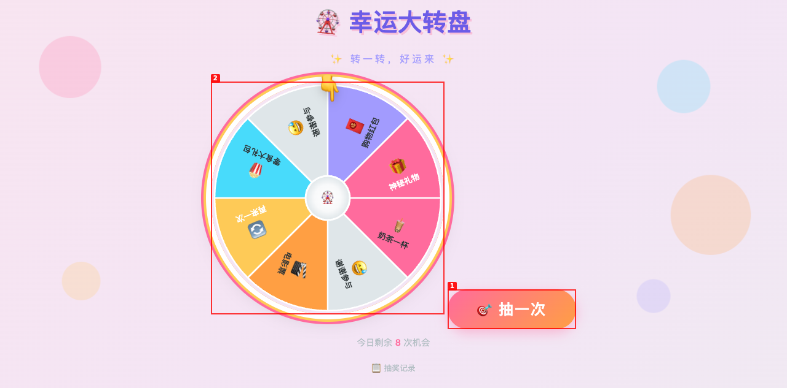
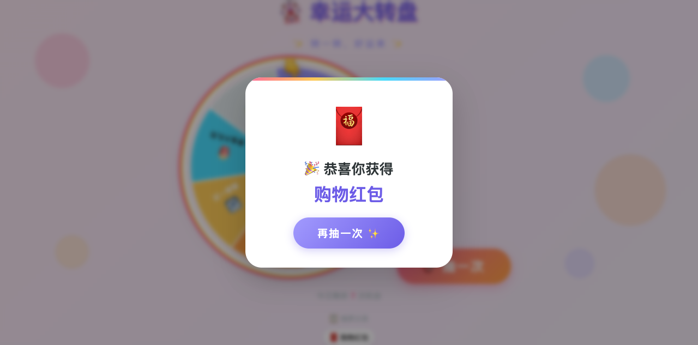

<div align="center">

# 🎡 幸运大转盘

**一个活泼可爱风格的交互式抽奖转盘网站**

✨ 转一转，好运来 ✨

</div>

---

## 🎯 功能特色

- **🎡 多彩转盘** — 8 个扇区各自独立配色，每区带 emoji 图标和奖品名称
- **🌀 流畅旋转** — Canvas 绘制 + `requestAnimationFrame` 驱动，`easeOutBack` 弹跳缓出模拟真实物理感
- **👇 动态指针** — 顶部爱心指针持续弹跳，增强互动感
- **🎊 彩色纸屑** — 中奖后 Canvas 粒子系统飘落缤纷 confetti
- **📋 抽奖记录** — 实时展示每次抽奖结果历史
- **⌨️ 键盘快捷键** — 空格/回车抽奖，Esc 关闭弹窗
- **🎨 活泼风格** — 多巴胺渐变色背景、飘浮气泡装饰、圆润按钮动效

## 🖼️ 界面预览

| 主页面 | 中奖弹窗 |
|:---:|:---:|
|  |  |

## 🏗️ 技术栈

- **前端** — 原生 HTML + CSS + JavaScript，零框架零依赖
- **动画** — CSS Animation + Canvas + requestAnimationFrame
- **服务端** — Node.js + Express 静态文件服务
- **纸屑** — Canvas 2D 粒子系统

## 🚀 快速开始

```bash
# 克隆仓库
git clone https://github.com/yxhsea/lucky-wheel.git
cd lucky-wheel

# 安装依赖
npm install

# 启动服务
npm start

# 浏览器打开
open http://localhost:3000
```

## 🎮 使用说明

1. 点击 **「🎯 抽一次」** 按钮或按 **空格键** 开始转盘
2. 转盘加速旋转后逐步减速停止
3. 弹窗显示中奖结果，并伴有彩色纸屑飘落
4. 点击 **「再抽一次 ✨」** 或按 **空格键** 关闭弹窗继续
5. 右上角可看到 **剩余抽奖次数** 和 **历史记录**

## 🎁 奖品列表

| 扇区 | 奖品 | Emoji |
|:---:|------|:----:|
| 1 | 奶茶一杯 | 🧋 |
| 2 | 谢谢参与 | 😅 |
| 3 | 电影票 | 🎬 |
| 4 | 再来一次 | 🔄 |
| 5 | 零食大礼包 | 🍿 |
| 6 | 谢谢参与 | 😅 |
| 7 | 购物红包 | 🧧 |
| 8 | 神秘礼物 | 🎁 |

## 📁 项目结构

```
lucky-wheel/
├── assets/               # 资源文件（截图等）
│   ├── screenshot-main.png
│   └── screenshot-modal.png
├── public/               # 前端静态文件
│   ├── index.html        # 主页面
│   ├── style.css         # 样式文件
│   └── script.js         # 交互逻辑
├── server.js             # Node.js Express 服务
├── package.json          # 项目配置
├── 设计文档.md            # 设计文档
└── README.md             # 本文件
```

## 📄 许可

MIT
